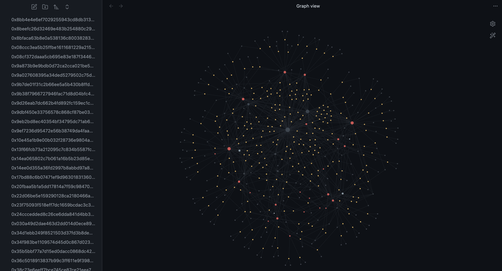

# Visualize the Ehereum Blockchain Using Obsidian

## Installation
### Code
Download the code:
```bash
git clone https://github.com/Nicolas-Gatien/ObsidianEthScanner.git
```
CD into the directory:
```bash
cd ObsidianEthScanner
```
Install the necessary libraries:
```bash
pip install -r requirements.txt
```

### Obsidian
Obsidian is a md note taking app that happens to have a really neat graph view.

You can download Obsidian with this link: https://obsidian.md/download

**Set up:** Open Obsidian, and open the `vault` folder as a vault

## Run the Code
Run the `loop.py` script to fetch the transactions, and open the graph view on Obsidian to visualize.
```bash
python3 loop.py
```